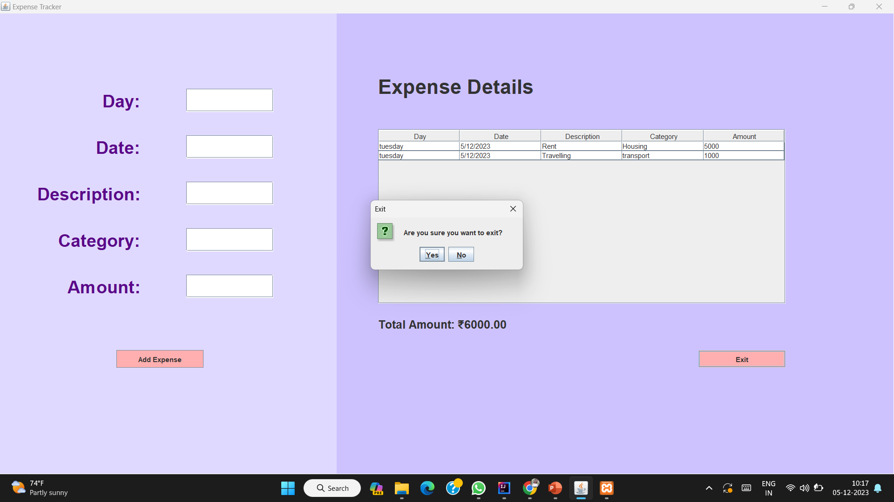

# Expense_Tracker_Project

The Expense Tracker is a desktop application built using Java Swing and MySQL, designed to help users effectively manage and monitor their financial transactions. This application offers an easy-to-use interface that allows users to track their income, expenses, and categorize them for better financial planning.

Key Features:
1. User Account Management:
- Secure login system to ensure each user’s financial data remains private.
- Users can create accounts and manage their personal financial records.
  
2. Expense and Income Tracking:
- Easily log daily expenses and income entries with details like date, category, and amount.
- View past transactions with a filter by date, category, or type (expense/income).

3. Category Management:
- Organize expenses and income by customizable categories such as Food, Transportation, Utilities, etc.
- Add, edit, or delete categories as needed for personalized tracking.

4. Financial Dashboard:
- Get an overview of total expenses, income, and savings at a glance.
- View graphical representations of spending trends over time to identify areas where you can cut costs or save more.
  
5. Reports and Analytics:
- Generate detailed financial reports for specific time periods.
- Analyze spending habits, income growth, and identify budget gaps through comprehensive reports.
  
6. Data Persistence:
- All user data is securely stored in a MySQL database to ensure persistent records across multiple sessions.
- Data integrity is maintained with robust database management.

Technologies Used:
- Java Swing (GUI)
- MySQL (Database)
- JDBC (Java Database Connectivity)

This Expense Tracker is ideal for individuals looking to manage their personal finances, offering an efficient and streamlined way to keep track of expenses, analyze spending patterns, and improve savings.
